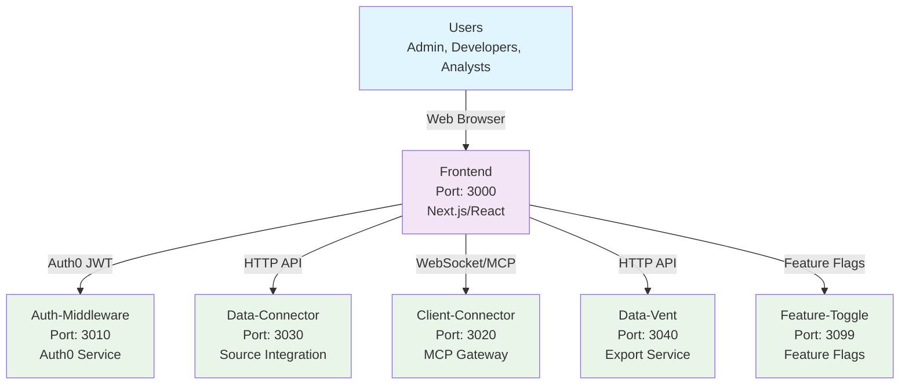

# ConFuse Frontend

> **Modern Web Interface for Knowledge Intelligence Platform**

## What is this service?

The **frontend** is ConFuse's modern web application built with Next.js, React, and TypeScript that provides a comprehensive interface for managing the knowledge platform, visualizing data, and interacting with AI agents.

## Quick Start

```bash
# Clone and install
git clone https://github.com/confuse/frontend.git
cd frontend

# Install dependencies
npm install

# Configure environment
cp .env.example .env.local

# Start development server
npm run dev
```

The application starts at: `http://localhost:3000`

## Documentation

| Document | Description |
|----------|-------------|
| [Architecture](architecture.md) | Application design and component structure |
| [Components](components.md) | UI components and design system |
| [API Integration](api-integration.md) | Service communication patterns |
| [Authentication](authentication.md) | Auth0 integration and security |
| [Deployment](deployment.md) | Production deployment guide |

## How It Fits in ConFuse



## Key Features

### 1. **Knowledge Management Dashboard**
- **System Overview**: Real-time platform status and health
- **Data Sources**: Monitor connected repositories and services
- **Processing Metrics**: Track ingestion and processing performance
- **Search Analytics**: User query patterns and results

### 2. **Source Management**
- **Repository Integration**: Connect GitHub, GitLab, Bitbucket repositories
- **Document Storage**: Link Google Drive, OneDrive, Notion workspaces
- **Sync Configuration**: Configure sync schedules and filters
- **Connection Health**: Monitor source connectivity and status

### 3. **Knowledge Search Interface**
- **Unified Search**: Semantic search across all knowledge sources
- **Advanced Filtering**: Filter by source, type, date, and metadata
- **Result Visualization**: Rich display of search results with context
- **Query History**: Track and reuse previous searches

### 4. **AI Agent Integration**
- **MCP Protocol**: Direct integration with AI agents via client-connector
- **Agent Management**: Configure and monitor AI agent connections
- **Query Interface**: Natural language query interface for agents
- **Response Display**: Rich formatting of AI agent responses

### 5. **Data Visualization**
- **Knowledge Graph**: Interactive graph visualization of relationships
- **Analytics Charts**: Processing metrics and usage statistics
- **Source Analytics**: Repository and document statistics
- **Performance Metrics**: System performance monitoring

## Technology Stack

| Technology | Purpose | Version |
|------------|---------|---------|
| **Next.js** | React Framework | 14.x |
| **React** | UI Library | 18.x |
| **TypeScript** | Type Safety | 5.x |
| **TailwindCSS** | Styling | 3.x |
| **Auth0** | Authentication | Latest |
| **Radix UI** | Component Library | Latest |
| **React Hook Form** | Form Management | Latest |
| **React Query** | Data Fetching | Latest |
| **Zustand** | State Management | Latest |

## Application Architecture

### Component Structure
```
src/
├── app/                    # Next.js App Router
│   ├── (auth)/            # Authentication routes
│   ├── dashboard/         # Dashboard pages
│   ├── sources/           # Source management
│   ├── search/            # Search interface
│   ├── agents/            # AI agent integration
│   └── settings/          # Application settings
├── components/             # Reusable components
│   ├── ui/                # Base UI components
│   ├── forms/             # Form components
│   ├── charts/            # Chart components
│   └── layout/            # Layout components
├── lib/                   # Utility libraries
│   ├── api/               # API clients
│   ├── auth/              # Authentication utilities
│   ├── utils/             # Helper functions
│   └── hooks/             # Custom React hooks
├── store/                 # State management
├── types/                 # TypeScript definitions
└── styles/                # Global styles
```

### Key Pages

#### Dashboard (`/dashboard`)
- **Overview Cards**: System status and key metrics
- **Activity Feed**: Recent processing activities
- **Health Monitoring**: Service health status
- **Quick Actions**: Common tasks and shortcuts

#### Sources (`/sources`)
- **Source List**: Connected data sources overview
- **Add Source**: Wizard for adding new sources
- **Source Details**: Individual source configuration
- **Sync Status**: Real-time sync progress

#### Search (`/search`)
- **Search Interface**: Advanced search form
- **Results Display**: Rich search results
- **Filters**: Search refinement options
- **Query Builder**: Visual query construction

#### Agents (`/agents`)
- **Agent List**: Connected AI agents
- **Agent Chat**: Direct agent interaction
- **Agent Settings**: Agent configuration
- **Query History**: Agent interaction history

## API Integration

### Service Communication
```typescript
// API client configuration
const apiClient = {
  authMiddleware: createApiClient('https://auth-middleware-k3bb.onrender.com'),
  dataConnector: createApiClient('https://data-connector-y472.onrender.com'),
  clientConnector: createApiClient('https://client-connector.onrender.com'),
  dataVent: createApiClient('https://data-vent.onrender.com'),
  featureToggle: createApiClient('http://localhost:3099')
}

// Example API call
const fetchSources = async () => {
  const response = await apiClient.dataConnector.get('/api/sources');
  return response.data;
};
```

### WebSocket Integration
```typescript
// WebSocket connection for real-time updates
const useWebSocket = (url: string) => {
  const [socket, setSocket] = useState<WebSocket | null>(null);
  const [data, setData] = useState<any>(null);
  
  useEffect(() => {
    const ws = new WebSocket(url);
    
    ws.onmessage = (event) => {
      setData(JSON.parse(event.data));
    };
    
    setSocket(ws);
    
    return () => {
      ws.close();
    };
  }, [url]);
  
  return { socket, data };
};
```

### MCP Protocol Integration
```typescript
// MCP client for AI agent communication
const useMCPClient = () => {
  const [client, setClient] = useState<MCPClient | null>(null);
  
  const connect = async (token: string) => {
    const mcpClient = new MCPClient('wss://client-connector.onrender.com/ws', token);
    await mcpClient.initialize();
    setClient(mcpClient);
  };
  
  const query = async (query: string) => {
    if (!client) throw new Error('MCP client not connected');
    return await client.callTool('semantic_search', { query });
  };
  
  return { connect, query, client };
};
```

## Authentication System

### Auth0 Integration
```typescript
// Auth0 configuration
export const auth0Config = {
  domain: process.env.NEXT_PUBLIC_AUTH0_DOMAIN!,
  clientId: process.env.NEXT_PUBLIC_AUTH0_CLIENT_ID!,
  redirectUri: process.env.NEXT_PUBLIC_AUTH0_REDIRECT_URI!,
  audience: process.env.NEXT_PUBLIC_AUTH0_AUDIENCE!
};

// Auth provider setup
export const AuthProvider = ({ children }: { children: React.ReactNode }) => {
  return (
    <Auth0Provider
      domain={auth0Config.domain}
      clientId={auth0Config.clientId}
      redirectUri={auth0Config.redirectUri}
      audience={auth0Config.audience}
    >
      {children}
    </Auth0Provider>
  );
};
```

### Protected Routes
```typescript
// Route protection middleware
const ProtectedRoute = ({ children }: { children: React.ReactNode }) => {
  const { isAuthenticated, isLoading } = useAuth0();
  
  if (isLoading) {
    return <LoadingSpinner />;
  }
  
  if (!isAuthenticated) {
    return <Redirect to="/login" />;
  }
  
  return <>{children}</>;
};
```

## State Management

### Zustand Store
```typescript
// Global state store
interface AppStore {
  // User state
  user: User | null;
  setUser: (user: User | null) => void;
  
  // Sources state
  sources: Source[];
  setSources: (sources: Source[]) => void;
  addSource: (source: Source) => void;
  
  // Search state
  searchResults: SearchResult[];
  setSearchResults: (results: SearchResult[]) => void;
  
  // UI state
  sidebarOpen: boolean;
  setSidebarOpen: (open: boolean) => void;
}

const useAppStore = create<AppStore>((set) => ({
  user: null,
  setUser: (user) => set({ user }),
  
  sources: [],
  setSources: (sources) => set({ sources }),
  addSource: (source) => set((state) => ({ 
    sources: [...state.sources, source] 
  })),
  
  searchResults: [],
  setSearchResults: (searchResults) => set({ searchResults }),
  
  sidebarOpen: true,
  setSidebarOpen: (sidebarOpen) => set({ sidebarOpen })
}));
```

## Component Library

### Design System
- **Color Palette**: Consistent color scheme
- **Typography**: Standardized text styles
- **Spacing**: Consistent spacing scale
- **Components**: Reusable UI components

### Base Components
```typescript
// Button component example
interface ButtonProps {
  variant: 'primary' | 'secondary' | 'outline';
  size: 'sm' | 'md' | 'lg';
  children: React.ReactNode;
  onClick?: () => void;
  disabled?: boolean;
}

export const Button: React.FC<ButtonProps> = ({
  variant,
  size,
  children,
  onClick,
  disabled
}) => {
  const baseClasses = 'font-medium rounded-md transition-colors';
  const variantClasses = {
    primary: 'bg-blue-600 text-white hover:bg-blue-700',
    secondary: 'bg-gray-600 text-white hover:bg-gray-700',
    outline: 'border border-gray-300 text-gray-700 hover:bg-gray-50'
  };
  
  return (
    <button
      className={`${baseClasses} ${variantClasses[variant]}`}
      onClick={onClick}
      disabled={disabled}
    >
      {children}
    </button>
  );
};
```

## Environment Configuration

### Required Environment Variables

#### `.env.local` (Local Development)
```bash
# Auth0 Configuration
NEXT_PUBLIC_AUTH0_DOMAIN=your_auth0_domain
NEXT_PUBLIC_AUTH0_CLIENT_ID=your_auth0_client_id
NEXT_PUBLIC_AUTH0_REDIRECT_URI=http://localhost:3000/api/auth/callback
NEXT_PUBLIC_AUTH0_AUDIENCE=https://api.confuse.dev

# Service URLs
NEXT_PUBLIC_API_BASE_URL=http://localhost:8000
NEXT_PUBLIC_AUTH_MIDDLEWARE_URL=https://auth-middleware-k3bb.onrender.com
NEXT_PUBLIC_DOC_DATA_CON_URL=https://doc-data-con.onrender.com
NEXT_PUBLIC_CLIENT_CONNECTOR_URL=https://client-connector.onrender.com
NEXT_PUBLIC_DATA_VENT_URL=https://data-vent.onrender.com
NEXT_PUBLIC_FEATURE_TOGGLE_URL=http://localhost:3099

# Application Configuration
NEXT_PUBLIC_APP_NAME=ConFuse
NEXT_PUBLIC_APP_VERSION=1.0.0
NEXT_PUBLIC_APP_ENVIRONMENT=development

# Feature Flags
NEXT_PUBLIC_ENABLE_AI_AGENTS=true
NEXT_PUBLIC_ENABLE_ADVANCED_SEARCH=true
NEXT_PUBLIC_ENABLE_DATA_EXPORT=true
NEXT_PUBLIC_ENABLE_ANALYTICS=true

# Analytics (Optional)
NEXT_PUBLIC_GOOGLE_ANALYTICS_ID=your_ga_id
NEXT_PUBLIC_SENTRY_DSN=your_sentry_dsn
```

#### `.env.production` (Production)
```bash
# Auth0 Configuration
NEXT_PUBLIC_AUTH0_DOMAIN=confuse.auth0.com
NEXT_PUBLIC_AUTH0_CLIENT_ID=your_production_client_id
NEXT_PUBLIC_AUTH0_REDIRECT_URI=https://confuse.platform.com/api/auth/callback
NEXT_PUBLIC_AUTH0_AUDIENCE=https://api.confuse.dev

# Service URLs
NEXT_PUBLIC_API_BASE_URL=https://api.confuse.dev
NEXT_PUBLIC_AUTH_MIDDLEWARE_URL=https://auth.confuse.dev
NEXT_PUBLIC_DOC_DATA_CON_URL=https://data.confuse.dev
NEXT_PUBLIC_CLIENT_CONNECTOR_URL=https://agents.confuse.dev
NEXT_PUBLIC_DATA_VENT_URL=https://export.confuse.dev
NEXT_PUBLIC_FEATURE_TOGGLE_URL=https://features.confuse.dev

# Application Configuration
NEXT_PUBLIC_APP_NAME=ConFuse
NEXT_PUBLIC_APP_VERSION=1.0.0
NEXT_PUBLIC_APP_ENVIRONMENT=production
```

## Performance Optimization

### Code Splitting
```typescript
// Dynamic imports for code splitting
const Dashboard = dynamic(() => import('../pages/Dashboard'), {
  loading: () => <LoadingSpinner />
});

const Sources = dynamic(() => import('../pages/Sources'), {
  loading: () => <LoadingSpinner />
});

const Search = dynamic(() => import('../pages/Search'), {
  loading: () => <LoadingSpinner />
});
```

### Image Optimization
```typescript
// Next.js Image component usage
import Image from 'next/image';

const OptimizedImage = ({ src, alt, ...props }) => (
  <Image
    src={src}
    alt={alt}
    width={800}
    height={600}
    placeholder="blur"
    blurDataURL="data:image/jpeg;base64,..."
    {...props}
  />
);
```

### Caching Strategy
```typescript
// React Query for data caching
const useSources = () => {
  return useQuery({
    queryKey: ['sources'],
    queryFn: fetchSources,
    staleTime: 5 * 60 * 1000, // 5 minutes
    cacheTime: 10 * 60 * 1000, // 10 minutes
  });
};
```

## Security Considerations

### Content Security Policy
```typescript
// CSP configuration in next.config.js
const ContentSecurityPolicy = `
  default-src 'self';
  script-src 'self' 'unsafe-eval' 'unsafe-inline';
  style-src 'self' 'unsafe-inline';
  img-src 'self' data: https:;
  font-src 'self';
  connect-src 'self' https://confuse.auth0.com https://api.confuse.dev;
`;

const securityHeaders = [
  {
    key: 'Content-Security-Policy',
    value: ContentSecurityPolicy.replace(/\s{2,}/g, ' ').trim()
  }
];
```

### Data Validation
```typescript
// Input validation with Zod
const SourceSchema = z.object({
  name: z.string().min(1).max(100),
  type: z.enum(['github', 'gitlab', 'google_drive', 'notion']),
  url: z.string().url(),
  config: z.object({
    branch: z.string().optional(),
    include_paths: z.array(z.string()).optional(),
    exclude_paths: z.array(z.string()).optional()
  })
});

type Source = z.infer<typeof SourceSchema>;
```

## Testing Strategy

### Unit Testing
```typescript
// Component testing with Jest and React Testing Library
import { render, screen, fireEvent } from '@testing-library/react';
import { Button } from '../components/Button';

describe('Button', () => {
  it('renders with correct text', () => {
    render(<Button variant="primary">Click me</Button>);
    expect(screen.getByText('Click me')).toBeInTheDocument();
  });
  
  it('calls onClick when clicked', () => {
    const handleClick = jest.fn();
    render(<Button variant="primary" onClick={handleClick}>Click me</Button>);
    
    fireEvent.click(screen.getByText('Click me'));
    expect(handleClick).toHaveBeenCalledTimes(1);
  });
});
```

### Integration Testing
```typescript
// API integration testing
import { renderHook, waitFor } from '@testing-library/react';
import { useSources } from '../hooks/useSources';

describe('useSources', () => {
  it('fetches and returns sources', async () => {
    const { result } = renderHook(() => useSources());
    
    await waitFor(() => {
      expect(result.current.data).toBeDefined();
      expect(Array.isArray(result.current.data)).toBe(true);
    });
  });
});
```

### E2E Testing
```typescript
// Playwright E2E tests
import { test, expect } from '@playwright/test';

test('user can add a new source', async ({ page }) => {
  await page.goto('/sources');
  
  await page.click('[data-testid="add-source-button"]');
  await page.fill('[data-testid="source-name"]', 'Test Repository');
  await page.selectOption('[data-testid="source-type"]', 'github');
  await page.fill('[data-testid="source-url"]', 'https://github.com/test/repo');
  
  await page.click('[data-testid="save-source-button"]');
  
  await expect(page.locator('[data-testid="success-message"]')).toBeVisible();
});
```

## Development Workflow

### Local Development
```bash
# Install dependencies
npm install

# Start development server
npm run dev

# Run linting
npm run lint

# Fix linting issues
npm run lint:fix

# Type checking
npm run type-check
```

### Build Process
```bash
# Production build
npm run build

# Start production server
npm start

# Analyze bundle size
npm run analyze
```

### Code Quality
```bash
# Run all tests
npm test

# Run tests in watch mode
npm test --watch

# Run E2E tests
npm run test:e2e

# Run accessibility tests
npm run test:a11y
```

## Deployment

### Docker Deployment
```dockerfile
FROM node:18-alpine AS base

# Install dependencies only when needed
FROM base AS deps
WORKDIR /app
COPY package.json package-lock.json ./
RUN npm ci --only=production

# Build the application
FROM base AS builder
WORKDIR /app
COPY . .
COPY --from=deps /app/node_modules ./node_modules
RUN npm run build

# Production image
FROM base AS runner
WORKDIR /app
ENV NODE_ENV production
COPY --from=builder /app/public ./public
COPY --from=builder /app/.next/standalone ./
COPY --from=builder /app/.next/static ./.next/static

EXPOSE 3000
ENV PORT 3000

CMD ["node", "server.js"]
```

### Kubernetes Deployment
```yaml
apiVersion: apps/v1
kind: Deployment
metadata:
  name: confuse-frontend
spec:
  replicas: 3
  selector:
    matchLabels:
      app: confuse-frontend
  template:
    metadata:
      labels:
        app: confuse-frontend
    spec:
      containers:
      - name: frontend
        image: confuse/frontend:latest
        ports:
        - containerPort: 3000
        env:
        - name: NEXT_PUBLIC_AUTH0_DOMAIN
          valueFrom:
            secretKeyRef:
              name: confuse-secrets
              key: auth0-domain
```

## Troubleshooting

### Common Issues

#### "Build fails with TypeScript errors"
- Check TypeScript configuration
- Verify type definitions
- Run `npm run type-check` for detailed errors

#### "Authentication not working"
- Verify Auth0 configuration
- Check redirect URI settings
- Ensure proper environment variables

#### "API calls failing"
- Verify service URLs in environment
- Check CORS configuration
- Monitor network requests in browser

#### "Performance issues"
- Check bundle size with `npm run analyze`
- Optimize images and assets
- Implement code splitting

### Debug Mode
```bash
# Enable debug logging
DEBUG=* npm run dev

# Run with verbose output
npm run dev -- --verbose

# Enable React DevTools
REACT_APP_DEBUG=true npm run dev
```

## Best Practices

### Code Organization
- Follow Next.js App Router conventions
- Use TypeScript for type safety
- Implement proper error boundaries
- Use consistent naming conventions

### Performance
- Implement code splitting
- Optimize images and assets
- Use React.memo for expensive components
- Implement proper caching strategies

### Security
- Validate all user inputs
- Implement proper CSP headers
- Use HTTPS in production
- Regularly update dependencies

### Accessibility
- Use semantic HTML elements
- Implement ARIA labels
- Test with screen readers
- Follow WCAG guidelines

## Contributing

### Development Guidelines
1. **Code Style**: Follow ESLint and Prettier configurations
2. **Components**: Create reusable, composable components
3. **Testing**: Write tests for new features
4. **Documentation**: Update documentation for changes
5. **Performance**: Consider performance implications

### Pull Request Process
1. Create feature branch from main
2. Implement changes with tests
3. Update documentation
4. Submit pull request with description
5. Address review feedback
6. Merge to main branch

## License

Proprietary - ConFuse Team
